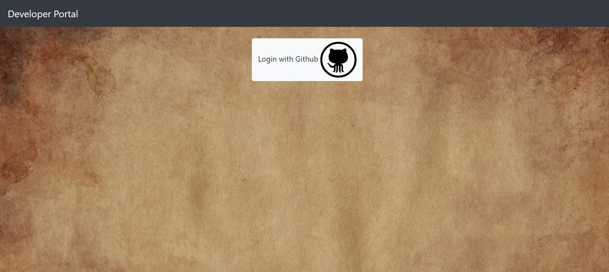
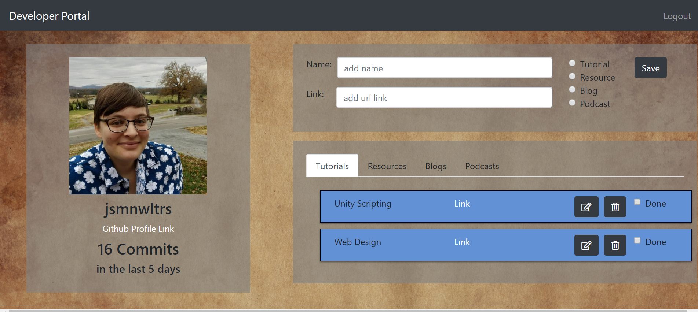

# Developer-Portal
This project was an introduction to creating a one page application with React. A user can login with their Github profile and create, update and delete items to store useful links and organize them into 4 separate tabs. Some of the user's github information also displays.


### How to run this app

* This app has been deployed to firebase and can be viewed here https://developer-portal-58b36.firebaseapp.com/

### To run on localhost

* Clone this project down from github and install the web dependencies in the terminal:
```sh
npm install
```
* Rename apiKeys.js.example file to apiKeys.js.
* Create a new project in Firebase and add your api keys to the apiKeys.js
* Run the server in the terminal:
```sh
npm start
```

## Screenshots

### Login Page


### Homepage

